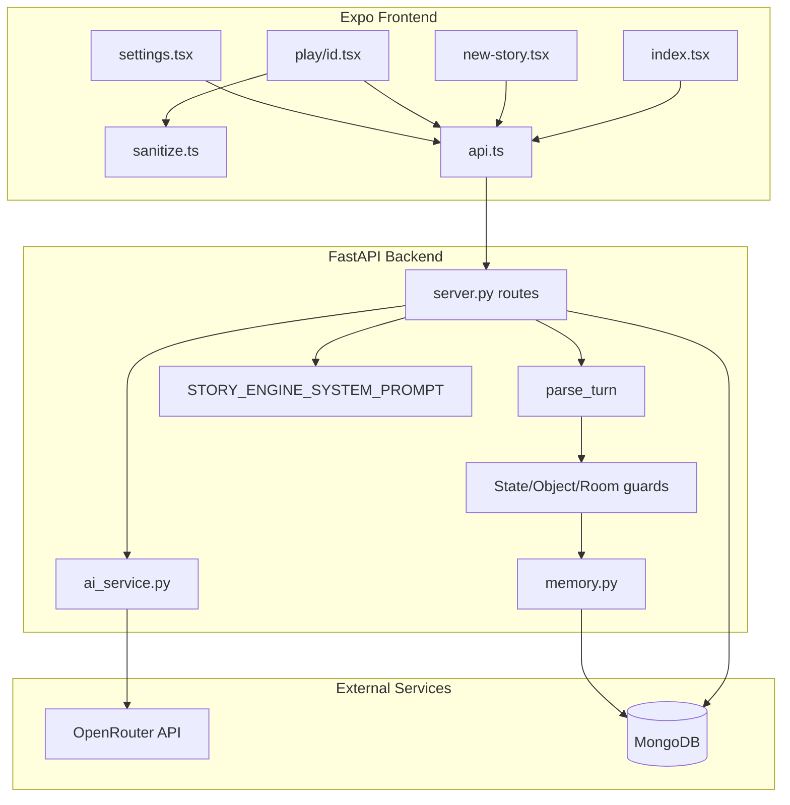

# Architecture

## High-level diagram

## Request lifecycle (story action)

1. **Client** sends `POST /api/story/action` with `session_id`, `action_text`, `debug_mode`.
2. **Server** loads session + prior turns from MongoDB.
3. **Message build** (`_build_messages`): system prompt, replay of recent turns (bounded by `memory_depth` / `history_window`), final user message with difficulty/mode/debug markers and embedded `<prior_state>`.
4. **Context budget** (`enforce_context_budget`): trim low-priority context if estimated prompt tokens exceed budget for active `cost_mode` + `mode`.
5. **LLM call** (`chat_completion_with_meta`): OpenRouter with per-session model lock and fallback chain; retries per model before stepping to next fallback.
6. **Parse** (`parse_turn`): extract `<narrative>`, `<choices>`, `<state>`, `<ledger>`, `<rolling_state>`, optional `<debug>`.
7. **Deterministic guards** (order matters):
   - State supremacy (Health/Fatigue cannot improve without cause)
   - Object permanence (inventory vs locations)
   - Ledger object permanence
   - Room audit / known rooms
   - NPC memory bounds
   - Faction consequence tick
   - Rolling state hygiene (meta scrub)
8. **Memory merge** (`consolidate_rolling_state`): union protected keys from prior turn; canonicalize object registry.
9. **Validate** (`_validate_parsed`): paragraph count, choice count, leak patterns; retry once if invalid.
10. **Persist** turn + update session (`turn_count`, `rolling_state`, `last_state`, model telemetry).
11. **Sanitize response** for player if `developer_mode` is off.
12. **Client** renders sanitized paragraphs/choices; optional debug panel if unlocked.

## Persistence model

### MongoDB collections

| Collection | Purpose |
|------------|---------|
| `sessions` | Chronicle metadata, rolling state snapshot, AI routing lock, turn count |
| `turns` | Per-turn narrative, choices, state, ledger, rolling_state, debug, raw |
| `admin_settings` | Global AI settings document (`key: "ai_settings"`) |

### Session document (key fields)

- Identity: `id`, `device_id`, `title`, `genre`, `role`, `tone`, `difficulty`, `mode`
- Story seed: `custom_premise`, `custom_world_setup`, `scenario_id`
- Runtime: `turn_count`, `last_narrative_snippet`, `last_state`, `rolling_state`, `rolling_state_updated_at`
- AI lock: `active_model`, `fallback_chain`, `model_switches`, `cost_mode`
- Flags: `debug_mode`

### Turn document (key fields)

- `turn_number`, `player_action`, `narrative`, `paragraphs`, `choices`
- `state` (player-visible chips), `ledger` (consequence ledger)
- `rolling_state` (full simulation packet — stripped from player API by default)
- `debug` (model telemetry, compression, context budget — dev only)
- `raw` (full LLM output — dev only)

### Client-side storage (AsyncStorage)

| Key | Content |
|-----|---------|
| `dice_device_id` | UUID for session listing |
| `dice_settings` | `debugDefault`, `fontScale`, `developerUnlocked` |

No chronicle data is stored offline on device; all story state lives on the server keyed by `device_id`.

## Concealment layers

Mechanic concealment is enforced at three levels:

1. **System prompt** — instructs the model not to expose rolls, modifiers, triggers, etc.
2. **Backend API sanitization** — removes `rolling_state`, `debug`, `raw`, internal state keys when `developer_mode` is false.
3. **Frontend presentation filter** — `sanitizeParagraphs` / `sanitizeChoices` strip leaked tags and mechanic lines from rendered text only (does not mutate stored turn data).

Developer access requires:
- 7-tap unlock on Settings version row → sets `developerUnlocked` locally
- `saveAdminSettings({ developer_mode: true })` on server
- Session `debug_mode: true` when submitting actions to receive `<debug>` blocks from the model

## AI configuration layers

| Layer | Source | Notes |
|-------|--------|-------|
| Environment | `ai_config.py`, `ai_service.py` | Defaults, fallback chain, timeouts, budgets |
| Database | `admin_settings` collection | Overrides via Settings UI / API |
| Session | `sessions.active_model`, `fallback_chain` | Locked at story creation |

## CORS

`CORS_ORIGINS` env var (default `*`) controls allowed origins on the FastAPI app.

## Unknown / not documented in code

- MongoDB indexes and migration strategy
- Production deployment topology (hosting, process manager, TLS termination)
- Whether `emergentintegrations` package is used at runtime (listed in `requirements.txt` but not imported in inspected app modules)
- Explicit `httpx` dependency declaration (`ai_service.py` imports it; not listed directly in `requirements.txt`)

**Export endpoint:** Documented in [api.md](./api.md) — returns unsanitized full session + turns (max 500), no `device_id` check.