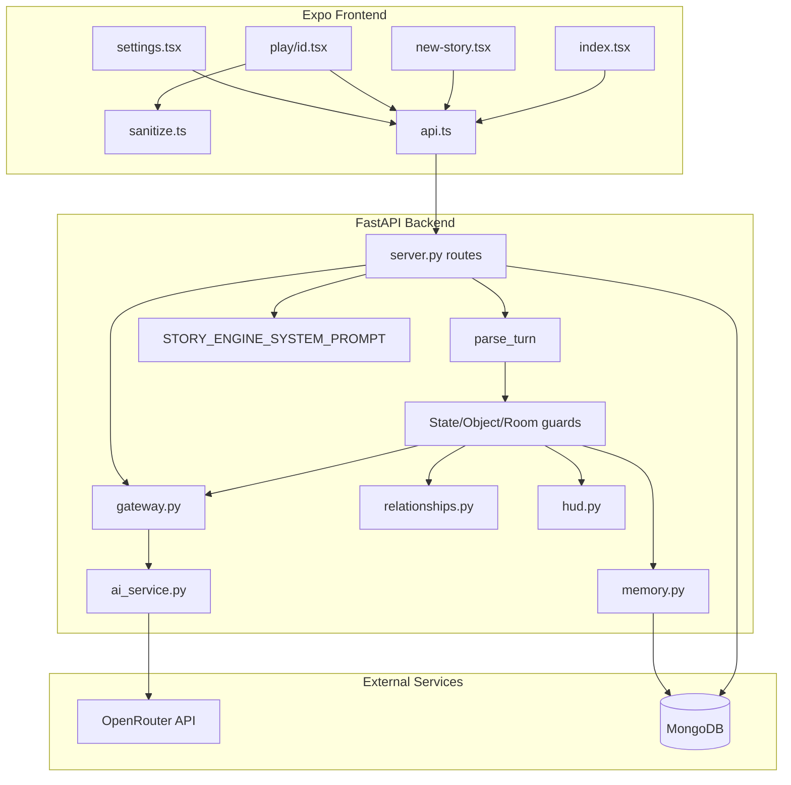

# Architecture

**Branch:** `emergent` — includes `gateway.py`, `relationships.py`, and `hud.py` not present on `main`.

## High-level diagram

## Request lifecycle (story action)

1. **Client** sends `POST /api/story/action` with `session_id`, `device_id`, `action_text`, `debug_mode`.
2. **Server** verifies ownership via `fetch_owned_session`, then loads session + prior turns from MongoDB.
3. **Message build** (`_build_messages`): system prompt, replay of recent turns (bounded by `memory_depth` / `history_window`), gateway truth block + relationship block + `<prior_state>`, final user message with difficulty/mode/debug markers.
4. **Context budget** (`enforce_context_budget`): trim low-priority context if estimated prompt tokens exceed budget for active `cost_mode` + `mode`.
5. **LLM call** (`gateway.invoke_llm` → `chat_completion_with_meta`): OpenRouter with per-session model lock and fallback chain; retries per model before stepping to next fallback.
6. **Parse** (`parse_turn`): extract `<narrative>`, `<choices>`, `<state>`, `<ledger>`, `<rolling_state>`, optional `<debug>`.
7. **Validate** (`_full_validate`): format checks via `_validate_parsed`; prose contradiction check via `detect_prose_contradictions`; retry once if invalid.
8. **Deterministic guards** (order matters on `story_action`):
   - State supremacy (Health/Fatigue cannot improve without cause)
   - Object permanence (inventory vs locations)
   - Gateway STRIP (`strip_illegal_state_changes`)
   - Rolling state consolidation (`consolidate_rolling_state`)
   - Ledger object permanence
   - Room audit / known rooms
   - NPC memory bounds
   - Faction / delayed / rumour ticks
   - Rolling state hygiene (meta scrub)
   - Gateway death registry (`update_death_registry`)
   - Gateway destruction registry (`update_destruction_registry`)
   - Relationship calculus (`update_relationship_calculus` — NPC→player)
   - HUD shaping (`shape_hud` — DNG/MOM/PRS, strip Objective)
9. **Persist** turn + update session (`turn_count`, `rolling_state`, `last_state`, model telemetry).
10. **Build player response** via `player_api` allowlist serializers (always sanitised).
11. **Client** renders sanitized paragraphs/choices; DNG/MOM/PRS chips; optional debug panel if unlocked.

Turn 1 (`new_story`) follows the same guard tail (steps 8–9) after object permanence, without state supremacy or gateway STRIP on prior state (no prior rolling state).

## Anti-Hallucination Gateway (`gateway.py`)

| Function | Role |
|----------|------|
| `invoke_llm` | Sole approved LLM invocation chokepoint (Ch 31.11) |
| `build_immutable_truth_block` | PREVENT — inject established facts into prompt |
| `strip_illegal_state_changes` | STRIP — revert illegal mutations before merge |
| `detect_prose_contradictions` | DETECT — flag prose vs truth for retry |
| `update_death_registry` | Record deceased NPCs as engine truth |
| `update_destruction_registry` | Record terminal object statuses |

Authoritative truth = prior `session.rolling_state` + `session.last_state`. Gateway never calls LLM except via `invoke_llm` routing to `ai_service`.

## Relationship calculus (`relationships.py`)

- Storage: `rolling_state['relationship_vectors']` — **protected** in `memory.py`
- Directionality: **NPC → player only** (four dimensions: trust, loyalty, fear, resentment)
- Authority: prior turn vectors; LLM-injected vectors ignored (`test_engine_owns_vectors_ignores_llm_injection`)
- Per turn: neglect decay, regex event detection, stance sync on `npcs` list
- Prompt: `build_relationship_block` — behavioural guidance without exposing numbers to player UI
- **Not supported:** NPC↔NPC edges, actor resolution, Utility AI

## HUD shaping (`hud.py`)

| Chip | Key | Values / behaviour |
|------|-----|-------------------|
| Danger | `Danger` (label **DNG**) | `none`, `low`, `elevated`, `high`, `critical` — derived from health/stress/threats if LLM value invalid |
| Momentum | `Momentum` (label **MOM**) | `surging`, `steady`, `stalling`, `declining`, `lost` — defaults to `steady` if invalid |
| Pressure | `Pressure` (label **PRS**) | Single non-prescriptive phrase; Objective/Goal keys stripped |

Frontend: `frontend/app/play/[id].tsx` maps chips to colour-coded labels DNG, MOM, PRS.

## Persistence model

### MongoDB collections

| Collection | Purpose |
|------------|---------|
| `sessions` | Chronicle metadata, rolling state snapshot, AI routing lock, turn count |
| `turns` | Per-turn narrative, choices, state, ledger, rolling_state, debug, raw |
| `admin_settings` | Global AI settings document (`key: "ai_settings"`) |

### Session document (key fields)

- Identity: `id`, `device_id`, `title`, `genre`, `role`, `tone`, `difficulty`, `mode`
- Story seed: `custom_premise`, `custom_world_setup`, `scenario_id`
- Runtime: `turn_count`, `last_narrative_snippet`, `last_state`, `rolling_state`, `rolling_state_updated_at`
- AI lock: `active_model`, `fallback_chain`, `model_switches`, `cost_mode`
- Flags: `debug_mode`

### Turn document (key fields)

- `turn_number`, `player_action`, `narrative`, `paragraphs`, `choices`
- `state` (player-visible chips including DNG/MOM/PRS after `shape_hud`)
- `ledger` (consequence ledger)
- `rolling_state` (full simulation packet — includes `relationship_vectors`; stripped from player API by default)
- `debug` (model telemetry, compression, context budget, guard adjustments — dev only)
- `raw` (full LLM output — dev only)

### Client-side storage (AsyncStorage)

| Key | Content |
|-----|---------|
| `dice_device_id` | UUID for session listing |
| `dice_settings` | `debugDefault`, `fontScale`, `developerUnlocked` |

No chronicle data is stored offline on device; all story state lives on the server keyed by `device_id` (listing only — not enforced on all routes).

## Concealment layers

Mechanic concealment is enforced at three levels:

1. **System prompt** — instructs the model not to expose rolls, modifiers, triggers, etc.
2. **Gateway + validation** — truth block, strip illegal changes, contradiction retry.
3. **Backend API sanitization** — removes `rolling_state`, `debug`, `raw`, internal state keys when `developer_mode` is false.
4. **Frontend presentation filter** — `sanitizeParagraphs` / `sanitizeChoices` strip leaked tags and mechanic lines from rendered text only (does not mutate stored turn data).

Developer access requires:
- 7-tap unlock on Settings version row → sets `developerUnlocked` locally
- `saveAdminSettings({ developer_mode: true })` on server (unauthenticated POST today)
- Session `debug_mode: true` when submitting actions to receive `<debug>` blocks from the model

## AI configuration layers

| Layer | Source | Notes |
|-------|--------|-------|
| Environment | `ai_config.py`, `ai_service.py` | Defaults, fallback chain, timeouts, budgets |
| Database | `admin_settings` collection | Overrides via Settings UI / API |
| Session | `sessions.active_model`, `fallback_chain` | Locked at story creation |

All runtime LLM calls resolve settings in `_generate_turn` then invoke via `gateway.invoke_llm`.

## CORS

`CORS_ORIGINS` env var (default `*`) controls allowed origins on the FastAPI app.

## Security primitives (`security.py`)

| Function | Role |
|----------|------|
| `fetch_owned_session` | Load session; verify `device_id`; generic 403/404 errors |
| `require_admin` | FastAPI dependency — `ADMIN_API_KEY` env + `X-Admin-Api-Key` header |

## Security surface

| Route class | Auth | Sanitization |
|-------------|------|--------------|
| Protected story routes | `X-Device-Id` ownership | `player_api` allowlists (all routes) |
| `POST /story/new` | body `device_id` + rate limits | `rate_limit.py` before LLM/insert |
| Player `/export` | `X-Device-Id` ownership | `player_api` allowlists |
| Operator `/export/raw` | `X-Admin-Api-Key` | Full dump (no device credential) |
| Raw `/export/raw` | Admin key + `device_id` ownership | None — full payload |
| Admin `/api/admin/*` | `X-Admin-Api-Key` | N/A |

Device-scoped isolation — not full user accounts. See [api.md](./api.md) and ADR-012.

## Unknown / not documented in code

- MongoDB indexes and migration strategy
- Production deployment topology (hosting, process manager, TLS termination)
- ~~Whether `emergentintegrations` package is used at runtime~~ — **resolved**: never imported; removed from `requirements.txt` 2026-06-20
- Explicit `httpx` dependency declaration (`ai_service.py` imports it; not listed directly in `requirements.txt`)

**Export endpoint:** Documented in [api.md](./api.md) — returns unsanitized full session + turns (max 500), no `device_id` check.